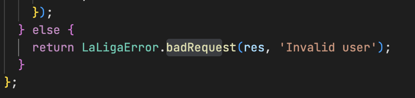

# Prueba técnica React de LaLiga

- Versión de Node >= 14.18.0
- Versión de Yarn >= 1.22.18
- Compatibilidad: ES6 Navegadores evergreen (Chrome, Firefox, Edge, Safari)

## Instrucciones

- [Instrucciones](client/src/docs/laliga-prueba-tecnica-instrucciones.md)

## Entorno de desarrollo local

### Estructura del proyecto

```text
|--carpeta-raiz
    |
    |--client
    |
    |--server
```

- En **client** es donde realizarás la prueba técnica solicitada.
- En **server** está incluida la API que debes consumir para tu desarrollo.
- <u>En server **no debes hacer ninguna modificación**</u>.
  <br />
  <br />

## Instalación y ejecución de `server`

```bash
cd server
yarn && yarn start

```

> Por defecto el servidor local de back se despliega en http://localhost:4000

> Puedes consultar la API en http://localhost:4000/api-docs/

<br />
<br />

## Instalación y ejecución de `client`

```bash
cd client
yarn && yarn start
```

> Por defecto el servidor local de front se despliega en http://localhost:3000

  <br />
  <br />

## Memoria

Librerias:

Husky: para ejectuar git hooks. Permite que el codigo que querramos subir al repositorio este libre de errores, impidiendo la subida/commit si los hubiese.
Se utilizara solamente el typecheck del cliente para agilizar los commits, sabiendo que el servidor no sera modificado y cumple con los requerimientos.

Eslint: se instalaron las dependencias necesarias y se realizo la configuracion correspondiente para trabajar con prettier.

Redux: Para el manejo de estados se utiliza redux y react-redux

Saga: Para aplicar middlewares se utilizara redux-saga

Axios: Para la llamada a la api


Custom scripts:

typecheck: para evaluar que el codigo typescript no tenga errores. Se puede ejecutar en todo el proyecto como solo en el cliente o servidor con algunas de sus variantes.

lint: para correr eslint dentro del cliente

pre-commit: corre tanto typechecks como lint


GitHooks:
  antes de realizar un commit se ejecutan el script pre-commit


environment variables:

template en .env.template


ACLARACIONES API:
  El error que devuelve una credencial fallida tiene un status de 400 (Bad request), mientras que en la documentacion el mismo es de 401 (Unauthorized).

